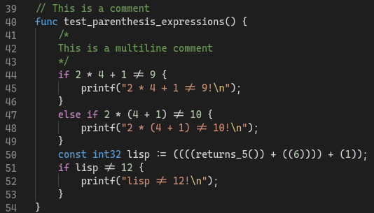

# C$ for VS Code

This extension adds support for the C$ programming language. This language was built for use in the [IFT580 - Compilation et interprétation des langages](https://www.usherbrooke.ca/admission/fiches-cours/ift580/compilation-et-interpretation-des-langages/) class at [Université de Sherbrooke](https://www.usherbrooke.ca/).

## Features

The only feature this extension currently supports is syntax highlighting. The syntax highlighting is inspired by that of the VS Code C# extension, as this is the main language that C$ takes inspiration from.

There currently are no plans to add new features to the extension. I might add more if I ever feel like it. With that said contributions are more than welcome!
